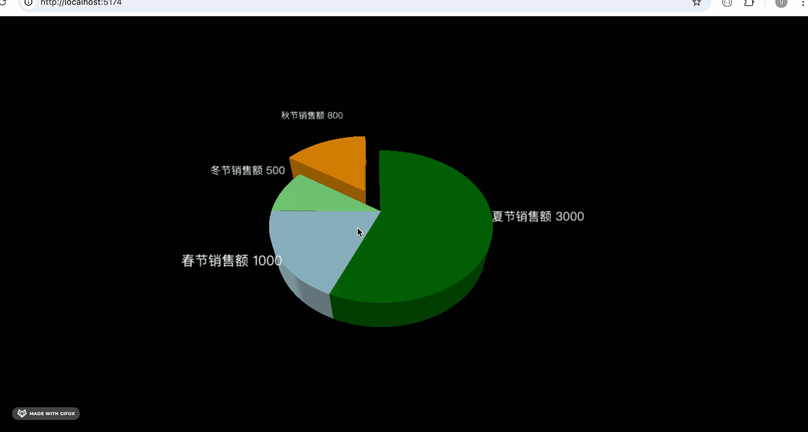
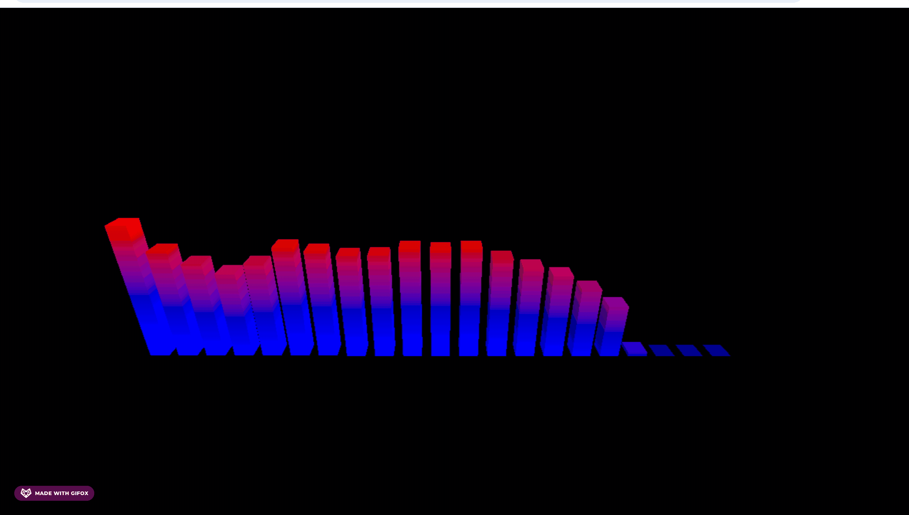
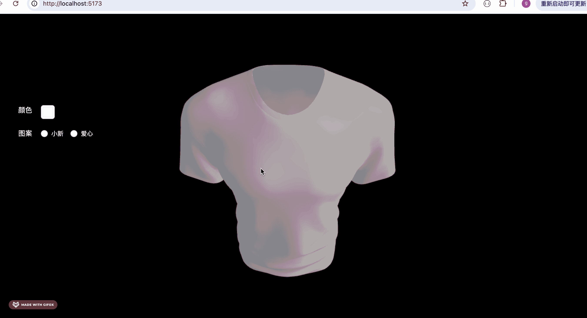
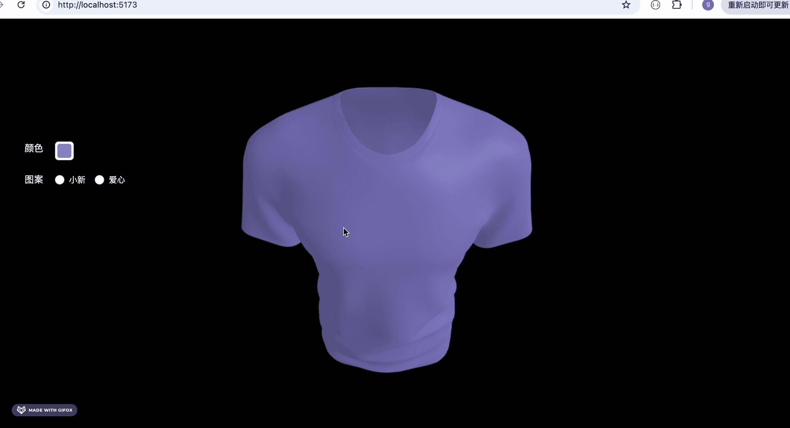
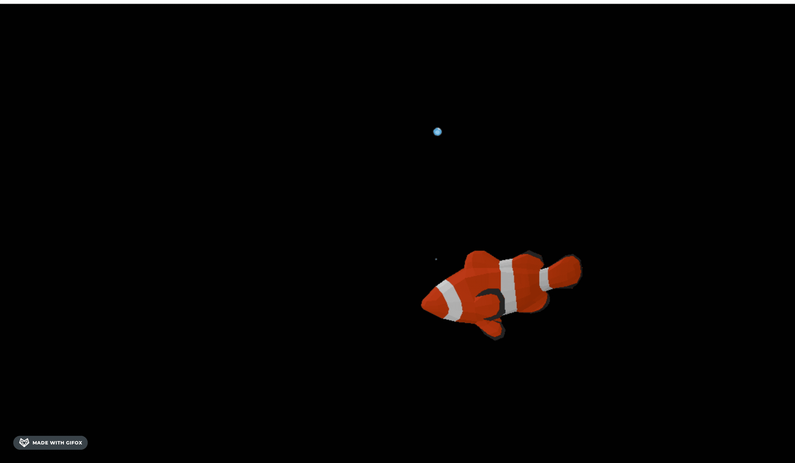
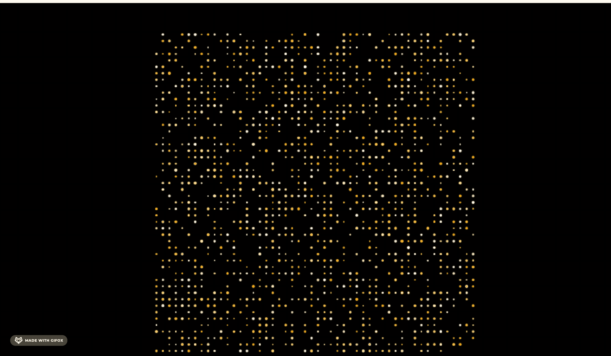
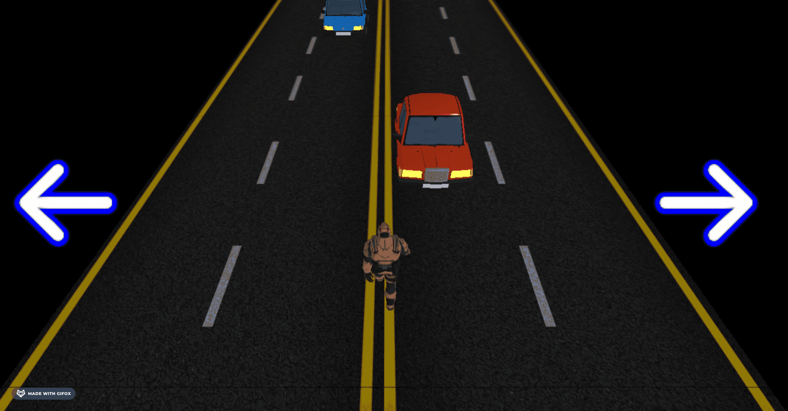

# threejs-course-code

掘金小册[《Three.js 通关秘籍》](https://juejin.cn/book/7481132169944498226)案例代码 

npx live-server 起个静态服务就可以访问

如果是 vite 项目，那就先 npm install 再 npm run dev

[第一个 3D 场景](./first-scene/)

[dat.gui 可视化调试](./data-gui/)

[深入理解透视相机和视椎体](./perspective-camera/)

[BufferGeometry：顶点生成几何体](./buffer-geometry/)

[点模型、线模型、网格模型](./point-line-mesh/)

[实战：随机山脉地形](./mountain-terrain/)

[材质颜色和纹理贴图](./material-color-texture/)

[uv 坐标和 uv 动画](./texture-uv/)

[如何画各种曲线](./curve/)

[按照规律生成各种几何体](./generate-geometry/)

[实战：隧道穿梭](./tube-travel/)

[uv 动画实战：无限隧道穿梭](./infinite-tunnel/)

[实战：盖房子](./house/)

[场景遍历和世界坐标](./scene-group/)

[各种灯光和常用 helper](./light-helper/)

[顶点法线和反射原理](./vertex-normal/)

[自定义顶点颜色实现渐变](./geometry-color)

[实战：颜色渐变柱状图](./gradient-color-bar-chart/)

[如何加载外部模型](./gltf-model/)

[gltf 的三种文件结构](./gltf-structure/)

[gltf-pipeline: 处理 gltf 模型的工具](./gltf-pipeline-test/)

[DRACO：压缩 gltf 模型，提升加载性能](./gltf-draco-test/)

[包围盒与模型大小计算](./box3-test/)

[包围盒 Box3 常用 api](./box3-api/)

[正投影相机和 3 种灯光的阴影](./orthographic-camera-shadow/)

[OrbitControl 的常用属性方法](./orbit-controls/)

[射线与点击选中 3D 场景的物体](./ray-caster/)

[后期处理与描边发光效果](./post-processing/)

[各种后期处理效果](./all-pass/)

[精灵模型 Sprite 和下雪效果](./sprite/)

[实战：林海雪原](./snowy-forest/)

[几何体材质共用问题和 copy、clone](./material-share/)

[补间动画库 Tween.js](./tween-animation/)

[Tween.js 常用 API](./tween-all-feature/)

[关键帧动画和模型动画播放](./keyframes-animation/)

[丝滑入场动画](./tube-entry-animation/)

[改变顶点的变形动画](./morph-animation/)

[骨骼动画：关节带动顶点运动](./bone-animation/)

[GSAP:另一个常用动画库](./gsap-test/)

[CSS2DRenderer 实现标注：给 3D 物体加标签](./css2d-annotation/)

[CSS3DRenderer 实现标注：电视内容、公告栏内容](./css3d-annotation/)

[Sprite 结合 canvas 实现各种形状的标注](./canvas-sprite-annotation/)

[SpriteText：开箱即用的文字组件](./sprite-text-test/)

[实战：数字雨](./number-rain)

[Canvas 画各种图案作为纹理](./canvas-texture/)

[3D 场景如何加入音频](./audio-api/)

[实战：3D 饼图](./3d-pie-chart/)

[系统掌握噪声库 Simplex Noise](./simplex-noise-test/)

[实战:双人斗舞](./two-dancer/)

[音乐频谱可视化](./audio-analyser/)

[PBR 材质：逼真的金属、塑料、磨砂、喷漆、玻璃效果](./pbr-material/)

[PBR 实战：汽车选配](./car-config/)

[模型搜索和导入 blender 编辑](./model-download-edit/)

[MatCap 材质：通过光泽球实现伪光照效果](./matcap-material/)

[HDR：亮度范围更广的全景图](./hdr-background/)

[CubeCamera 实现镜子效果](./cube-camera-envmap/)

[Reflector 实现镜子效果](./reflector-mirror/)

[实战：练舞房](./dancing-mirror/)

[3d 音乐播放器](./3d-music-player/)

[Three.js 的各种控制器 Controls](./all-controls/)

[React 和 Three.js 集成](./react-three-app/)

[贴花几何体：给物体表面添加装饰](./decal-geometry/)

[实战：T恤印花设计](./t-shirt-design/)

[实战：3D 电脑](./css3d-computer/)

[实战：Three.js Editor](./threejs-editor/)

[向量点积实现锐角判断](./vector-dot/)

[实战：酷家乐装修编辑器](./home-decoration-editor/)

[react-three-fiber：组件化开发 3D 场景](./react-three-fiber-test/)

[物理引擎 cannon：实现真实世界的物理现象](./cannon-world/)

[物理引擎 cannon：凸多面体实现各种形状](./cannon-world/)

[粒子效果库 three-quraks](./three-quarks-test/)

[粒子实战：小猪爱心喷射器](./pig-heart-emmiter/)

[各种形状的粒子发射器](./all-shape-three-quarks/)

[粒子生命周期行为控制](./three-quarks-behavior-control/)

[粒子实战：火树银花](./three-quarks-fireworks/)

[粒子的帧动画](./three-quarks-frame-animation/)

[粒子实战：小鱼吐泡泡](./fish-bubbles/)

[打碎重组粒子效果](./three-quarks-texture-sequencer/)

[几何体粒子和噪声](./three-quarks-mesh-noise/)

[躲避汽车](./dodge-cars/)

[geojson 和地图绘制](./geojson-map/)
