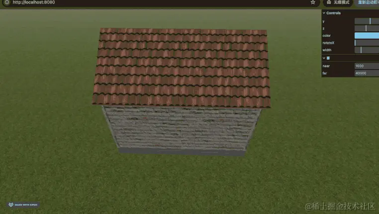
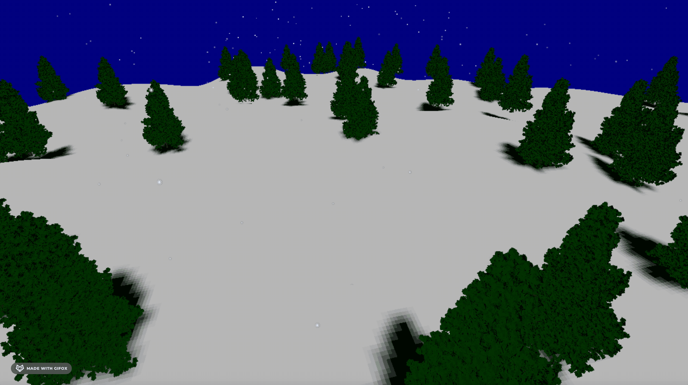
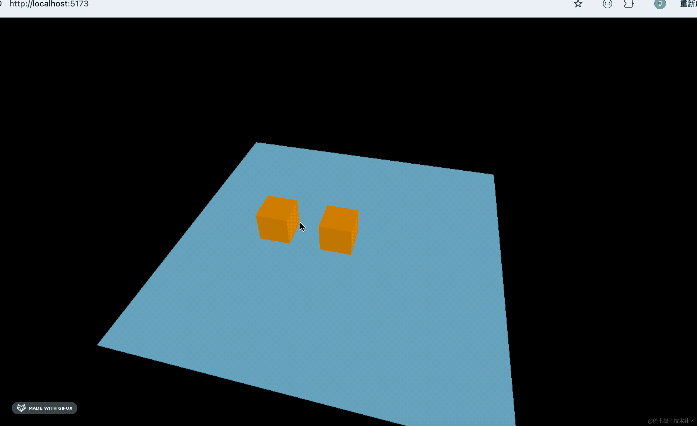

# threejs-course-code

掘金小册[《Three.js 通关秘籍》](https://juejin.cn/book/7481132169944498226)案例代码 

npx live-server 起个静态服务就可以访问

如果是 vite 项目，那就先 npm install 再 npm run dev

[第一个 3D 场景](./first-scene/)

[dat.gui 可视化调试](./data-gui/)

[深入理解透视相机和视椎体](./perspective-camera/)

[BufferGeometry：顶点生成几何体](./buffer-geometry/)

[点模型、线模型、网格模型](./point-line-mesh/)

[实战：随机山脉地形](./mountain-terrain/)

[材质颜色和纹理贴图](./material-color-texture/)

[uv 坐标和 uv 动画](./texture-uv/)

[如何画各种曲线](./curve/)

[按照规律生成各种几何体](./generate-geometry/)

[实战：隧道穿梭](./tube-travel/)

[uv 动画实战：无限隧道穿梭](./infinite-tunnel/)

[实战：盖房子](./house/)

[场景遍历和世界坐标](./scene-group/)

[各种灯光和常用 helper](./light-helper/)

[顶点法线和反射原理](./vertex-normal/)

[自定义顶点颜色实现渐变](./geometry-color)

[实战：颜色渐变柱状图](./gradient-color-bar-chart/)

[如何加载外部模型](./gltf-model/)

[gltf 的三种文件结构](./gltf-structure/)

[正投影相机和 3 种灯光的阴影](./orthographic-camera-shadow/)

[射线与点击选中 3D 场景的物体](./ray-caster/)

[后期处理与描边发光效果](./post-processing/)

[各种后期处理效果](./all-pass/)

[精灵模型 Sprite 和下雪效果](./sprite/)

[实战：林海雪原](./snowy-forest/)

[几何体材质共用问题和 copy、clone](./material-share/)

[补间动画库 Tween.js](./tween-animation/)

[关键帧动画和模型动画播放](./keyframes-animation/)

[丝滑入场动画](./tube-entry-animation/)

[改变顶点的变形动画](./morph-animation/)

[骨骼动画：关节带动顶点运动](./bone-animation/)

[CSS2DRenderer 实现标注：给 3D 物体加标签](./css2d-annotation/)

[CSS3DRenderer 实现标注：电视内容、公告栏内容](./css3d-annotation/)

[Sprite 结合 canvas 实现各种形状的标注](./canvas-sprite-annotation/)

[3D 场景如何加入音频](./audio-api/)

[实战:双人斗舞](./two-dancer/)

[PBR 材质：逼真的金属、塑料、磨砂、喷漆、玻璃效果](./pbr-material/)

[PBR 实战：汽车选配](./car-config/)

[React 和 Three.js 集成](./react-three-app/)

